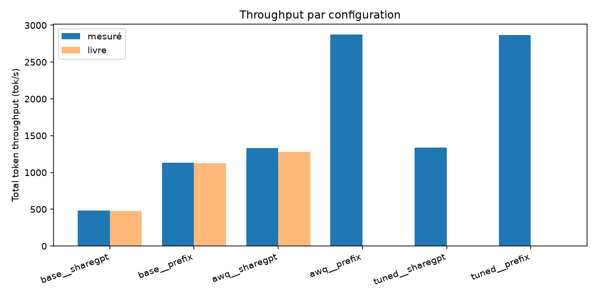
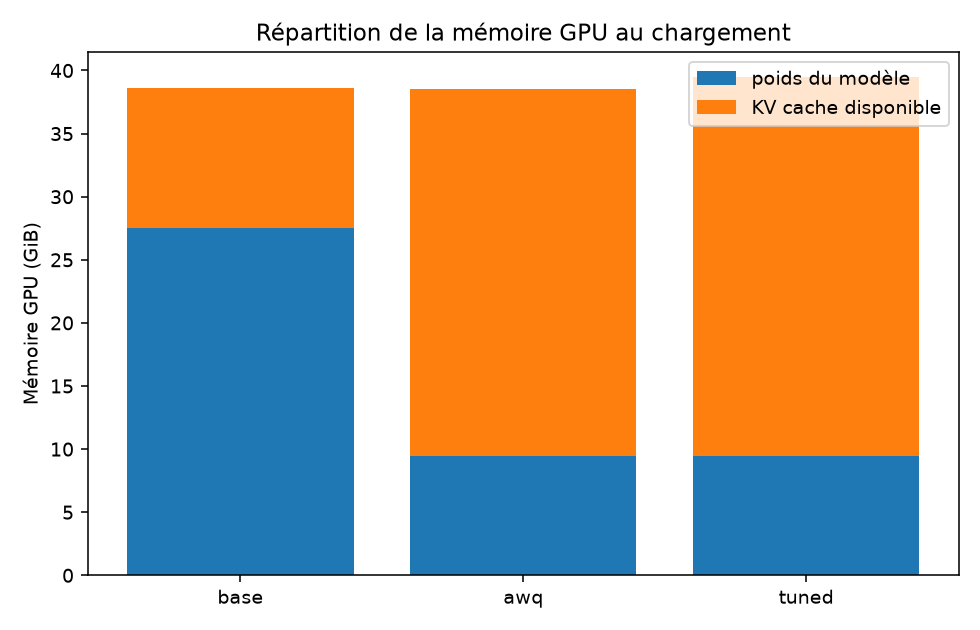

# vllm-optimization-lab

*[Version française](README.fr.md)*

**The book's numbers reproduce to within 1 %. Its explanation of them does not
survive the check.**

This repository re-runs the chapter 9 lab of *Hands-On LLM Serving and
Optimization* (Chi Wang & Peiheng Hu, O'Reilly): Qwen3-14B on a single NVIDIA
L40S 46 GB. AWQ quantization does deliver the throughput gain the chapter
reports, 2.77× here. But the mechanism the chapter credits for it, a larger KV
cache enabling bigger batches, is not what produced it: at `--max-concurrency
10` the KV cache never went past **6 % of its usable capacity**, not even in the
unquantized baseline. The gain comes from weight memory bandwidth during
decoding, and the numbers pin it down to the decimal.

Reaching that conclusion took more than running `vllm bench serve`, which
reports throughput and latency but says nothing about how GPU memory is split.
That split is what explains the results, and it only exists in the server's
startup logs. This harness parses it out and joins it to the benchmark metrics,
which is what made the real bottleneck visible.

One command runs the full configuration matrix, saves the raw results, and
regenerates the report from the data. The code is short and commented.

## Measurement environment

| | |
|---|---|
| GPU | NVIDIA L40S, 46,068 MiB, compute capability 8.9 |
| Stack | vLLM 0.29.0, torch 2.13.0+cu130, CUDA 13.0, driver 580.159.04 |
| Host | RunPod, region EU-NL-1, 32 vCPU, 125 GB RAM |
| Models | `Qwen/Qwen3-14B` and `Qwen/Qwen3-14B-AWQ` |
| Load | 2,000 ShareGPT prompts and 1,000 Prefix Repetition prompts, `--max-concurrency 10` |

A methodological note: the vLLM version used here is substantially newer than
the book's. The gaps below therefore measure how well the protocol holds up
across versions, not an identical replication.

## Results

### Throughput and latency

| Run | Total TPS | Output TPS | Mean TTFT | Mean ITL | Book TPS | Gap |
|---|---|---|---|---|---|---|
| `base__sharegpt` | 481.4 | 230.8 | 145.2 ms | 42.4 ms | 474.4 | +1 % |
| `base__prefix` | 1,135.6 | 225.4 | 150.2 ms | 43.2 ms | 1,123.1 | +1 % |
| `awq__sharegpt` | 1,334.2 | 640.1 | 75.6 ms | 15.2 ms | 1,280.0 | +4 % |
| `awq__prefix` | 2,873.0 | 570.8 | 110.7 ms | 16.5 ms | n/a | n/a |
| `tuned__sharegpt` | 1,335.3 | 639.8 | 73.8 ms | 15.2 ms | n/a | n/a |
| `tuned__prefix` | 2,867.1 | 570.3 | 104.5 ms | 16.6 ms | n/a | n/a |



Totals are not comparable across the two datasets: Prefix Repetition sends 512 k
input tokens for 127 k output, ShareGPT 447 k for 412 k. Total token throughput
counts both, and an input token is far cheaper than an output token. **Output
TPS is the metric that compares datasets**, and it stays flat (230.8 against
225.4 on the baseline).

### GPU memory at load time

| Config | Weights | KV cache | Cacheable tokens | Max concurrency |
|---|---|---|---|---|
| `base` | 27.52 GiB | 11.06 GiB | 72,496 | 1.77× |
| `awq` | 9.44 GiB | 29.09 GiB | 190,672 | 4.66× |
| `tuned` | 9.44 GiB | 30.03 GiB | 196,784 | 4.80× |



The total bar barely moves; what shifts is the boundary inside it.

## What the measurements show

**1. AWQ multiplies throughput by 2.77, but not through the stated mechanism.**
The book explains the gain as a chain: fewer weight bytes → more KV cache → more
batching → more throughput. The measurements confirm the first two links and
invalidate the third under these conditions. At `--max-concurrency 10` the KV
cache was never the binding constraint, not even in the baseline. A ShareGPT
request averages 429 tokens; the `base` cache holds 72,496 of them, which is
**room for 169 concurrent requests when the benchmark asks for 10**. The
bottleneck is elsewhere:

| | `base` | `awq` | ratio |
|---|---|---|---|
| Model weights | 27.52 GiB | 9.44 GiB | **2.92×** |
| Mean ITL | 42.4 ms | 15.2 ms | **2.79×** |

Decoding is bound by memory bandwidth on weight reads: every generated token
requires reading the entire model. Dividing the weights by 2.92 divides
per-token time by 2.79, and total throughput follows at exactly 2.77×. Here
quantization accelerates decoding; it never had to unlock batching. The cache
expansion (1.77× to 4.66× sustainable concurrency) is real, but this protocol
never exercised it.

**2. Manual tuning changes nothing.** `tuned` adds
`--gpu-memory-utilization 0.95`, `--enable-prefix-caching`,
`--enable-chunked-prefill`, `--max-num-seqs 512`, `--max-num-batched-tokens 8192`
and `--block-size 16`. Result: 1,335.3 against 1,334.2 TPS, or +0.08 %, inside
the noise. Two causes compound. Prefix caching and chunked prefill have been
**on by default since vLLM 0.29**, so those flags only re-request what is
already there. And the one real gain, 0.94 GiB of extra KV cache, applies to the
resource the previous point shows was not the bottleneck.

**3. Prefix caching works and stays invisible in throughput.** Server logs give
a cumulative reuse rate of 0.2 % at the end of the ShareGPT phase and 49.5 % at
the end of the Prefix Repetition phase, which puts the prefix phase alone around
90 %. The mechanism clearly fired. But it only touches prefill, which costs
145 ms against roughly 8.6 s of decoding per request: TTFT on `base__prefix`
stays at 150 ms for 512 input tokens, against 145 ms for 223 tokens with no
cache. Saving prefill does not show up on a decode-dominated workload.

**4. Distributed serving depends on the interconnect, not the GPU.** Not
reproduced here, see [docs/findings.md](docs/findings.md).

## Divergences from the book

The memory profile reproduces almost exactly, despite a much newer vLLM:

| Measurement | This repo | Book | Gap |
|---|---|---|---|
| `base` weights | 27.52 GiB | 27.5185 GiB | identical |
| `base` KV cache | 11.06 GiB | 11.00 GiB | +0.5 % |
| `base` cacheable tokens | 72,496 | 72,064 | +0.6 % |
| `base` max concurrency | 1.77× | 1.76× | +0.6 % |
| `awq` weights | 9.44 GiB | 9.36 GiB | +0.9 % |
| `awq` cacheable tokens | 190,672 | 191,056 | -0.2 % |

That is expected once you see where these numbers come from: they are dictated
by model size and card size, not by the server version. The server only decides
the margin it reserves for itself, and that margin has barely moved.

Throughput holds too, at +1 % on both `base` runs and +4 % on `awq__sharegpt`.
ITL follows (42.4 ms against the authors' 43.2 on `base__sharegpt`), which
places model execution at the same level.

**One metric does not reproduce: TTFT.** 145.2 ms against the authors' 104.2 on
`base__sharegpt`, and 75.6 against 59.3 on `awq__sharegpt`, so +27 % to +39 %.
Since throughput and ITL land on target, the gap is not the GPU: it sits on the
request admission path, the tokenizer or the host, not in decoding. That part
was not instrumented during the campaign, so the cause is unknown. It is
recorded as an unresolved divergence rather than smoothed over.

**The real gap is not numerical, it is explanatory.** The book's numbers
reproduce; its interpretation of the AWQ gain does not survive verification,
because the protocol caps concurrency at 10 and never puts the KV cache under
pressure.

## The technical point of the harness

`vllm bench serve` measures throughput and latency but says nothing about how
GPU memory is split. That split is what explains the results, and those numbers
live only in the startup logs:

```
Model loading took 27.52 GiB memory and 51.881960 seconds
Available KV cache memory: 11.06 GiB
GPU KV cache size: 72,496 tokens
Maximum concurrency for 40,960 tokens per request: 1.77x
```

[`src/lab/parse_startup.py`](src/lab/parse_startup.py) extracts them and
[`collect.py`](src/lab/collect.py) joins them to the benchmark metrics per
configuration. That join is what puts throughput next to the KV cache size
supposed to cap it, instead of observing a gain with no way to explain it.
Without it, finding #1 above was out of reach: dividing cacheable tokens by mean
request length is what exposes the real bottleneck.

## The matrix

| `run_id` | Model | Dataset | Flags |
|---|---|---|---|
| `base__sharegpt` | Qwen3-14B | ShareGPT | vLLM defaults |
| `base__prefix` | Qwen3-14B | Prefix Repetition | vLLM defaults |
| `awq__sharegpt` | Qwen3-14B-AWQ | ShareGPT | `--quantization awq` |
| `awq__prefix` | Qwen3-14B-AWQ | Prefix Repetition | `--quantization awq` |
| `tuned__sharegpt` | Qwen3-14B-AWQ | ShareGPT | + prefix caching, chunked prefill, wider batching and cache |
| `tuned__prefix` | Qwen3-14B-AWQ | Prefix Repetition | same |

The two datasets do not measure the same thing. **ShareGPT** is real traffic with
widely scattered lengths, which is exactly the case continuous batching exists to
absorb. **Prefix Repetition** is synthetic and acts as a cache probe: the fewer
unique prefixes, the stronger the reuse signal.

`base` and `awq` run on **default flags**, as in the book
(`vllm serve Qwen/Qwen3-14B`). That is the condition for the load-time log lines
to stay comparable to the authors': pinning `--max-model-len` would change the
reported concurrency and break the comparison. Tuning only enters with `tuned`.

The full matrix takes about two hours on an L40S, 30 minutes of which go to
`base__sharegpt` alone.

## Host requirements

Three constraints, learned by burning three rented pods before landing a good
one. `make setup` checks them and stops dead if one fails, because each takes
seconds to detect and is expensive to discover later.

| Constraint | Threshold | What happens otherwise |
|---|---|---|
| **VRAM** | 48 GB | The fp16 model takes 27.5 GB: on 24 GB the baseline does not exist |
| **Bandwidth to Hugging Face** | 20 MB/s target, 5 MB/s floor | At 0.5 MB/s, 28 GB of weights take 17 hours |
| **CUDA supported by the driver** | 13.0 for vLLM 0.29 | `torch.cuda.is_available()` returns `False`, nothing runs |

The third is the least obvious. vLLM wheels are compiled against a specific CUDA
version, and 12.x to 13.x is a major jump: minor-version compatibility no longer
applies, and an r580 or newer driver is required. On RunPod, the "Available CUDA
versions" filter on the deployment page is the right lever, and a host
advertising only 12.8 should be skipped.

The vLLM version is pinned in `00-setup.sh` (`VLLM_VERSION`, 0.29.0 by default).
A bare `pip install vllm` conflicts with the torch preinstalled in RunPod images
and makes the resolver backtrack to 2025 releases, where `vllm bench serve` does
not exist yet.

## Usage

```bash
git clone https://github.com/samilazrak/vllm-optimization-lab && cd vllm-optimization-lab
make setup    # host qualification, pinned vLLM, ShareGPT
make sweep    # the full matrix, then collect + report
```

To bypass the qualification gates: `SKIP_HOST_CHECKS=1 make setup`.

A single run:

```bash
make serve CONFIG=awq
make bench CONFIG=awq DATASET=sharegpt
make stop
```

The analysis needs no GPU and replays anywhere, on the versioned JSON:

```bash
uv venv && uv pip install -e .
make collect   # results/raw/*.json → results/summary.csv
make report    # results/summary.csv → results/report.md + figures/
```

## Layout

| Path | Role |
|---|---|
| [`scripts/00-setup.sh`](scripts/00-setup.sh) | Steps 1 and 2: hardware, vLLM, datasets |
| [`scripts/01-serve.sh`](scripts/01-serve.sh) | Step 4: parameterized server, load-log capture |
| [`scripts/02-bench.sh`](scripts/02-bench.sh) | Steps 5 and 6: traffic and metrics |
| [`scripts/03-sweep.sh`](scripts/03-sweep.sh) | The matrix end to end, unattended |
| [`src/lab/parse_startup.py`](src/lab/parse_startup.py) | Pulls memory figures out of vLLM logs |
| [`src/lab/collect.py`](src/lab/collect.py) | Joins bench + load logs → `results/summary.csv` |
| [`src/lab/report.py`](src/lab/report.py) | Comparison tables and figures |
| [`results/summary.csv`](results/summary.csv) | The 6 runs, one row each |
| [`results/report.md`](results/report.md) | Generated report |
| `results/raw/` | Bench JSON and startup logs, versioned |
| [`docs/findings.md`](docs/findings.md) | Interpretation, gaps to the book, what is not reproduced |

## Limitations

- **Concurrency is capped at 10 on the client side.** This is the limitation that
  weighs most on the conclusions: it leaves the KV cache at 6 % of its usable
  capacity and therefore prevents measuring the effect the book attributes to
  quantization. Testing it would mean pushing `--max-concurrency` past 170 on
  ShareGPT, or lengthening contexts substantially.
- **Distributed serving (step 8 of the book) is not reproduced.** It requires two
  multi-GPU pods with different interconnects. The `tp2` and `tp4` configs exist
  in `01-serve.sh` but are not in the default matrix. The reasoning and the
  book's numbers are in `docs/findings.md`, presented as such and never as
  measurements.
- **Quantized model quality is not evaluated.** The lab measures throughput, not
  4-bit degradation. A 2.77× throughput gain says nothing about the precision
  cost.
- **Every data point is a single run.** No repetition, so no dispersion measure.
  The percent-level gaps above should be read with that caveat.
- **Results hold only for this GPU and this traffic.** That is the point of the
  chapter: an overfitted configuration does not generalize.

## Reference

Chi Wang, Peiheng Hu, *Hands-On LLM Serving and Optimization*, O'Reilly,
chapter 9, "LLM Optimization in Practice".
